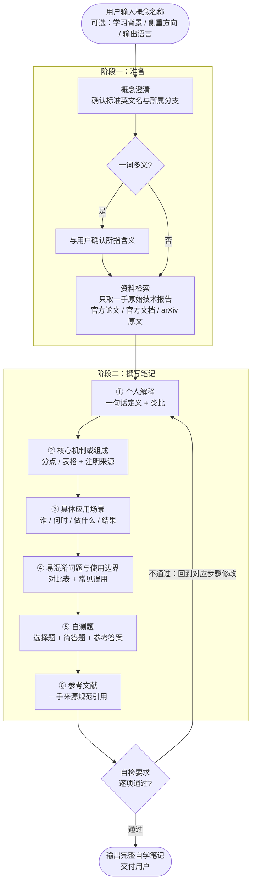

# 概念自学笔记生成器（concept-self-learner）

本 skill 用于把一个陌生的人工智能概念快速转化为一份可读、可核查、可复习的结构化自学笔记。它是一个**通用**的概念学习工具，可以处理任何新概念（例如：Agent、上下文、Skill、RAG、思维链、KV 缓存、多模态、强化学习、向量数据库、模型蒸馏……），而不局限于某几个固定词汇。

## 适用场景

- 在学习 AI / 大模型相关课程或阅读论文时，遇到一个不熟悉的术语，需要快速建立系统性认识。
- 想把零散的"听说过"变成"能讲清楚"，并留下可复习的笔记沉淀。
- 需要为学习小组或课程作业产出一份格式统一、口径一致的概念说明文档。
- 概念较新、教材未覆盖，需要从公开网络资料中归纳整理。

不适用场景（应主动告知用户）：

- 需要教科书级别的完整知识体系（应系统学习教材或课程）。
- 涉及内部资料、未公开技术细节（无法核查，容易产生幻觉）。

## 输入信息

调用本 skill 时，需要（或建议）提供以下信息：

| 输入项 | 是否必需 | 说明 |
| --- | --- | --- |
| 概念名称 | 必需 | 要学习的 AI 概念，如"大模型上下文""混合专家模型" |
| 学习背景 | 可选 | 用户的现有基础，用于调整解释深度（入门 / 进阶） |
| 侧重方向 | 可选 | 如偏工程实践、偏原理、偏行业应用 |
| 输出语言 | 可选 | 默认中文，术语保留英文原文 |

若只给了概念名称，按"入门读者 + 中文输出"处理，并在笔记开头注明该假设。

## 生成步骤

按顺序执行以下步骤：

1. **概念澄清**：判断该概念在 AI 领域的标准英文名、所属分支（模型架构 / 推理技术 / 应用范式 / 工程实践等），若该词在社区存在多种含义，先列出常见歧义。
2. **资料检索**：至少检索 2–3 个独立来源，**只采用一手原始技术报告**——Anthropic / OpenAI 等官方论文与官方工程博客、官方产品文档，以及方法原作者发表的 arXiv 原始论文；禁止引用百科、自媒体、论坛等二次转载网站。记录每条来源的作者/机构、标题、日期与 URL。
3. **通俗解释**：用"个人解释"的口吻，先一句话定义，再用类比或对比讲清楚它解决什么问题。禁止堆砌术语。
4. **机制拆解**：归纳概念的核心组成或工作原理，尽量用列表 / 小表格呈现，注明信息出自哪个来源。
5. **场景落地**：构造一个具体的、贴近真实工作或生活的应用场景，说明该概念在哪里被用到、发挥了什么作用。
6. **边界辨析**：整理最容易混淆的相近概念，用对比表格区分；说明该概念的适用边界与常见误用。
7. **出题自测**：围绕笔记核心内容命制 3–4 道选择题与 2 道简答题，附参考答案；题目须能被笔记原文直接回答。
8. **资料汇编**：把检索到的一手来源整理成"参考文献"，采用规范引用格式（作者/机构. 标题. 来源, 日期. 链接），置于文档最末。
9. **自检修订**：按下方"自检要求"逐项检查，不通过则回到对应步骤修改。

## 工作流程图



## 输出结构

输出的笔记为一份 Markdown 文档，**固定包含以下六部分**，顺序不可调换：

```markdown
# <概念名称>自学笔记

## 1. 个人解释
用自己的话，先一句话定义，再展开说明它解决什么问题。

## 2. 核心机制或组成
分点 / 小表格说明该概念的内部构成或工作原理。

## 3. 一个具体应用场景
一个完整、具体、可想象的真实场景（而非抽象罗列）。

## 4. 容易混淆的问题或使用边界
- 与相近概念的区别（推荐对比表）
- 适用边界与常见误用

## 5. 自测题（含参考答案）
3–4 道选择题 + 2 道简答题，附参考答案与答案出处章节。

## 6. 参考文献
一手原始技术报告，规范引用格式（作者/机构. 标题. 来源, 日期. 链接），置于文档最末。
```

## 资料来源要求

- **一手优先（强制）**：参考文献只允许一手原始技术报告，包括 Anthropic / OpenAI 等官方论文与官方工程博客、官方产品文档、方法原作者发表的 arXiv 原始论文；**禁止**引用百科、自媒体、论坛、社交平台等二次转载或二手解读网站。
- **真实性**：所有链接必须是真实可访问的公开网址；禁止编造 URL。
- **可核查**：每条文献采用规范引用格式（作者/机构. 标题. 来源, 日期. 链接），并逐一打开验证。
- **多样性**：至少 3 条、至多 6 条，且来自至少 2 个不同来源。
- **时效性**：涉及快速演进的技术时，优先选取近 1–2 年的官方资料；经典论文可不受此限。
- **标注**：正文中的关键论断若直接来自某资料，应在该部分末尾注明来源编号。

## 自检要求

生成笔记后，逐项自查，全部通过才算完成：

1. **六部分齐全**：①个人解释 ②核心机制或组成 ③具体应用场景 ④易混淆问题或使用边界 ⑤自测题（含参考答案） ⑥参考文献，顺序与标题完整，参考文献位于文档最末。
2. **一手来源**：参考文献全部为一手原始技术报告（官方论文 / 官方文档 / arXiv 原文），无百科、自媒体等二次网站。
3. **零幻觉**：所有事实性陈述均有来源支撑；无法核实的内容必须显式标注"待核实"，不得编造。
4. **链接可用**：每条参考文献链接均可正常访问（逐一打开验证），无 404、无重定向到无关页面。
5. **人话检测**：个人解释部分不含未拆解的行话堆砌；一个不具备该领域背景的读者能读懂。
6. **场景具体**：应用场景包含"谁、在什么情况下、用它做了什么、得到什么结果"，而非抽象列举。
7. **边界清晰**：至少辨析 1 个易混淆概念，并明确指出使用边界或常见误用。
8. **自测有效**：自测题均可由笔记原文直接回答，参考答案正确且注明出处章节。
9. **通用性**：本笔记格式不依赖特定概念，换一个概念名称仍可复用同一结构。
